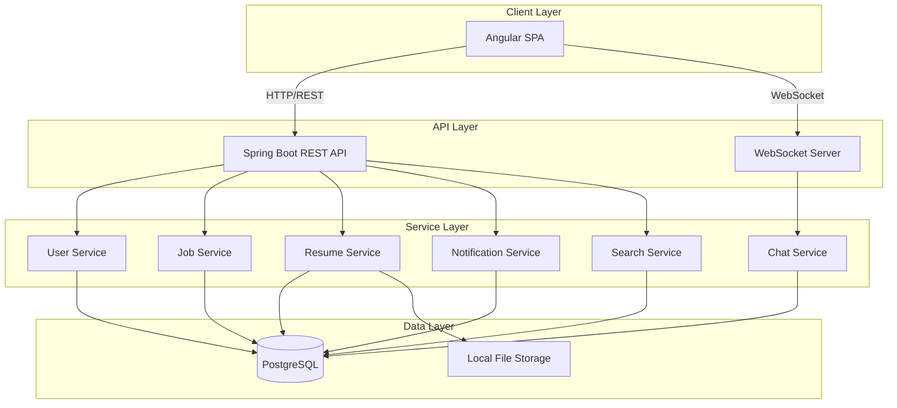

# Design Document

## Overview

Hirable is a three-tier web application built with Angular frontend, Spring Boot backend, and PostgreSQL database. The system implements role-based access control for three user types (Admin, Job Seeker, Recruiter) and provides job matching capabilities through keyword search, resume management, and real-time chat communication.

For demo purposes, the system uses simplified authentication with hardcoded credentials and local file storage instead of cloud storage. The architecture prioritizes modularity and clear separation of concerns to enable easy feature additions and maintenance.

## Architecture

### High-Level Architecture



### Technology Stack

**Frontend:**
- Angular 15+ with TypeScript
- Angular Material for UI components
- RxJS for reactive programming
- WebSocket client for real-time chat

**Backend:**
- Spring Boot 3.x with Java 17
- Spring Security with JWT authentication
- Spring WebSocket for chat
- Spring Data JPA for database access
- Apache PDFBox for PDF parsing
- Apache POI for DOC parsing

**Database:**
- PostgreSQL 14+ for relational data
- Flyway for database migrations

**File Storage:**
- Local filesystem for demo (resumes stored in configurable directory)

## Components and Interfaces

### Frontend Components

#### Shared Components
- **LoginComponent**: Handles authentication for all user roles
- **NavigationComponent**: Role-based navigation menu
- **NotificationComponent**: Displays in-app notifications with unread count

#### Job Seeker Components
- **JobSeekerDashboardComponent**: Overview of applications and recruiter interest
- **ProfileComponent**: Edit personal information, skills, experience, education
- **ResumeUploadComponent**: Upload and manage resume files
- **JobSearchComponent**: Search jobs with filters (keyword, location, industry, experience)
- **JobDetailsComponent**: View job posting details and apply
- **ChatComponent**: Real-time messaging with recruiters

#### Recruiter Components
- **RecruiterDashboardComponent**: Overview of job postings and candidate pipeline
- **CompanyProfileComponent**: Edit company and recruiter information
- **JobPostingFormComponent**: Create and edit job postings
- **CandidateSearchComponent**: Search talent pool with filters (skills, experience, location)
- **CandidateProfileComponent**: View candidate details and resume
- **ShortlistComponent**: Manage shortlisted candidates
- **ChatComponent**: Real-time messaging with job seekers

#### Admin Components
- **AdminDashboardComponent**: Analytics and system overview
- **UserManagementComponent**: CRUD operations for users
- **JobManagementComponent**: Approve, reject, remove job postings
- **TalentPoolComponent**: View and moderate resumes
- **SystemConfigComponent**: Manage categories, industries, skills taxonomy
- **ChatModerationComponent**: Monitor and moderate chat conversations
- **AnalyticsComponent**: Usage statistics and reports

### Backend API Endpoints

#### Authentication API
```
POST /api/auth/login
  Request: { username, password }
  Response: { token, role, userId }
```

#### User API
```
GET    /api/users/{id}
POST   /api/users (Admin only)
PUT    /api/users/{id}
DELETE /api/users/{id} (Admin only - deactivate)
GET    /api/users (Admin only - list all)
```

#### Job Seeker API
```
GET    /api/jobseekers/{id}/profile
PUT    /api/jobseekers/{id}/profile
POST   /api/jobseekers/{id}/resume
GET    /api/jobseekers/{id}/resume
GET    /api/jobseekers/{id}/applications
POST   /api/jobseekers/{id}/applications
```

#### Recruiter API
```
GET    /api/recruiters/{id}/profile
PUT    /api/recruiters/{id}/profile
GET    /api/recruiters/{id}/jobs
POST   /api/recruiters/{id}/jobs
PUT    /api/recruiters/{id}/jobs/{jobId}
DELETE /api/recruiters/{id}/jobs/{jobId}
GET    /api/recruiters/{id}/shortlist
POST   /api/recruiters/{id}/shortlist
DELETE /api/recruiters/{id}/shortlist/{candidateId}
```

#### Job API
```
GET    /api/jobs (search with query params)
GET    /api/jobs/{id}
GET    /api/jobs/pending (Admin only)
PUT    /api/jobs/{id}/approve (Admin only)
PUT    /api/jobs/{id}/reject (Admin only)
DELETE /api/jobs/{id} (Admin only)
```

#### Candidate Search API
```
GET    /api/candidates/search?skills=java&experience=3&location=bangalore
  Response: [ { candidateId, name, skills, experience, location, relevanceScore, lastResumeUpdate } ]
```

#### Chat API
```
GET    /api/chats/{userId}
POST   /api/chats
GET    /api/chats/{chatId}/messages
GET    /api/chats/all (Admin only)
PUT    /api/chats/{chatId}/flag (Admin only)
```

#### WebSocket Endpoints
```
CONNECT /ws
SUBSCRIBE /user/queue/messages
SEND /app/chat.send
```

#### Notification API
```
GET    /api/notifications/{userId}
PUT    /api/notifications/{id}/read
GET    /api/notifications/{userId}/unread-count
```

#### Admin API
```
GET    /api/admin/analytics
GET    /api/admin/categories
POST   /api/admin/categories
PUT    /api/admin/categories/{id}
GET    /api/admin/industries
POST   /api/admin/industries
PUT    /api/admin/industries/{id}
GET    /api/admin/skills
POST   /api/admin/skills
PUT    /api/admin/skills/{id}
```

### Service Layer Interfaces

#### UserService
```java
interface UserService {
    User authenticate(String username, String password);
    User createUser(UserDTO userDTO);
    User updateUser(Long userId, UserDTO userDTO);
    void deactivateUser(Long userId);
    List<User> getAllUsers();
    User getUserById(Long userId);
}
```

#### JobService
```java
interface JobService {
    Job createJob(Long recruiterId, JobDTO jobDTO);
    Job updateJob(Long jobId, JobDTO jobDTO);
    void deleteJob(Long jobId);
    List<Job> searchJobs(JobSearchCriteria criteria);
    Job getJobById(Long jobId);
    List<Job> getPendingJobs();
    void approveJob(Long jobId);
    void rejectJob(Long jobId, String reason);
    List<Job> getJobsByRecruiterId(Long recruiterId);
}
```

#### ResumeService
```java
interface ResumeService {
    Resume uploadResume(Long jobSeekerId, MultipartFile file);
    Resume getResume(Long jobSeekerId);
    ParsedResumeData parseResume(MultipartFile file);
    void updateRelevanceScore(Long jobSeekerId);
}
```

#### CandidateSearchService
```java
interface CandidateSearchService {
    List<CandidateSearchResult> searchCandidates(CandidateSearchCriteria criteria);
    double calculateRelevanceScore(JobSeeker candidate, CandidateSearchCriteria criteria);
}
```

#### ChatService
```java
interface ChatService {
    Chat createChat(Long recruiterId, Long jobSeekerId);
    Message sendMessage(Long chatId, Long senderId, String content);
    List<Message> getChatMessages(Long chatId);
    List<Chat> getUserChats(Long userId);
    List<Chat> getAllChats(); // Admin only
    void flagChat(Long chatId, String reason);
}
```

#### NotificationService
```java
interface NotificationService {
    void createNotification(Long userId, NotificationType type, String message);
    List<Notification> getUserNotifications(Long userId);
    void markAsRead(Long notificationId);
    int getUnreadCount(Long userId);
}
```

## Data Models

### User Entity
```java
@Entity
class User {
    Long id;
    String username;
    String passwordHash;
    UserRole role; // ADMIN, JOB_SEEKER, RECRUITER
    String email;
    boolean active;
    LocalDateTime createdAt;
    LocalDateTime lastLoginAt;
}
```

### JobSeeker Entity
```java
@Entity
class JobSeeker {
    Long id;
    @OneToOne User user;
    String firstName;
    String lastName;
    String phone;
    String location;
    String summary;
    @ElementCollection List<String> skills;
    @OneToMany List<Experience> experiences;
    @OneToMany List<Education> educations;
    String resumeFilePath;
    LocalDateTime resumeUploadedAt;
    double relevanceScore;
}
```

### Experience Entity
```java
@Entity
class Experience {
    Long id;
    String company;
    String title;
    LocalDate startDate;
    LocalDate endDate;
    String description;
}
```

### Education Entity
```java
@Entity
class Education {
    Long id;
    String institution;
    String degree;
    String fieldOfStudy;
    LocalDate graduationDate;
}
```

### Recruiter Entity
```java
@Entity
class Recruiter {
    Long id;
    @OneToOne User user;
    String firstName;
    String lastName;
    String phone;
    String companyName;
    String companyWebsite;
    String companyDescription;
    String industry;
}
```

### Job Entity
```java
@Entity
class Job {
    Long id;
    @ManyToOne Recruiter recruiter;
    String title;
    String description;
    @ElementCollection List<String> requiredSkills;
    String location;
    String experienceLevel; // ENTRY, MID, SENIOR
    String industry;
    JobStatus status; // PENDING, APPROVED, REJECTED, REMOVED
    LocalDateTime postedAt;
    LocalDateTime approvedAt;
}
```

### Application Entity
```java
@Entity
class Application {
    Long id;
    @ManyToOne JobSeeker jobSeeker;
    @ManyToOne Job job;
    ApplicationStatus status; // APPLIED, SHORTLISTED, REJECTED
    LocalDateTime appliedAt;
}
```

### Chat Entity
```java
@Entity
class Chat {
    Long id;
    @ManyToOne Recruiter recruiter;
    @ManyToOne JobSeeker jobSeeker;
    LocalDateTime createdAt;
    boolean flagged;
    String flagReason;
}
```

### Message Entity
```java
@Entity
class Message {
    Long id;
    @ManyToOne Chat chat;
    @ManyToOne User sender;
    String content;
    LocalDateTime sentAt;
    boolean read;
}
```

### Notification Entity
```java
@Entity
class Notification {
    Long id;
    @ManyToOne User user;
    NotificationType type; // JOB_APPLICATION, RECRUITER_INTEREST, CHAT_MESSAGE, JOB_APPROVED
    String message;
    boolean read;
    LocalDateTime createdAt;
}
```

### Shortlist Entity
```java
@Entity
class Shortlist {
    Long id;
    @ManyToOne Recruiter recruiter;
    @ManyToOne JobSeeker jobSeeker;
    LocalDateTime addedAt;
}
```

### Taxonomy Entities
```java
@Entity
class Category {
    Long id;
    String name;
}

@Entity
class Industry {
    Long id;
    String name;
}

@Entity
class Skill {
    Long id;
    String name;
}
```

## Error Handling

### Exception Hierarchy
```java
class HirableException extends RuntimeException
class UserNotFoundException extends HirableException
class UnauthorizedException extends HirableException
class InvalidFileFormatException extends HirableException
class JobNotFoundException extends HirableException
class ChatNotFoundException extends HirableException
```

### Global Exception Handler
```java
@RestControllerAdvice
class GlobalExceptionHandler {
    @ExceptionHandler(UserNotFoundException.class)
    ResponseEntity<ErrorResponse> handleUserNotFound(UserNotFoundException ex);
    
    @ExceptionHandler(UnauthorizedException.class)
    ResponseEntity<ErrorResponse> handleUnauthorized(UnauthorizedException ex);
    
    @ExceptionHandler(InvalidFileFormatException.class)
    ResponseEntity<ErrorResponse> handleInvalidFile(InvalidFileFormatException ex);
    
    @ExceptionHandler(Exception.class)
    ResponseEntity<ErrorResponse> handleGenericException(Exception ex);
}
```

### Error Response Format
```json
{
  "timestamp": "2025-11-25T10:30:00",
  "status": 404,
  "error": "Not Found",
  "message": "User with id 123 not found",
  "path": "/api/users/123"
}
```

### Frontend Error Handling
- Display user-friendly error messages using Angular Material snackbar
- Log errors to console for debugging
- Redirect to login on 401 Unauthorized
- Show generic error page on 500 Internal Server Error

## Security Design

### Authentication Flow
1. User submits credentials to `/api/auth/login`
2. Backend validates against hardcoded credentials (demo mode)
3. Backend generates JWT token with user ID and role
4. Frontend stores token in localStorage
5. Frontend includes token in Authorization header for subsequent requests
6. Backend validates token and extracts user context for each request

### Hardcoded Demo Credentials
```java
// Admin
username: admin@hirable.com
password: admin123

// Recruiter
username: recruiter@techcorp.com
password: recruiter123

// Job Seeker
username: jobseeker@email.com
password: jobseeker123
```

### Role-Based Access Control
```java
@PreAuthorize("hasRole('ADMIN')")
void adminOnlyMethod();

@PreAuthorize("hasAnyRole('RECRUITER', 'ADMIN')")
void recruiterMethod();

@PreAuthorize("hasAnyRole('JOB_SEEKER', 'ADMIN')")
void jobSeekerMethod();
```

### File Upload Security
- Validate file extensions (only .pdf, .doc, .docx)
- Limit file size to 5MB
- Sanitize filenames to prevent path traversal
- Store files with UUID-based names

## Resume Parsing Strategy

### Parsing Approach
1. Extract text content from PDF/DOC using Apache PDFBox/POI
2. Use regex patterns to identify sections (Experience, Education, Skills)
3. Extract structured data from identified sections
4. Map extracted data to JobSeeker entity fields

### Parsing Patterns
```java
// Skills extraction
Pattern skillsPattern = Pattern.compile("(?i)skills?:?\\s*([\\s\\S]*?)(?=experience|education|$)");

// Experience extraction
Pattern experiencePattern = Pattern.compile("(?i)experience:?\\s*([\\s\\S]*?)(?=education|skills|$)");

// Education extraction
Pattern educationPattern = Pattern.compile("(?i)education:?\\s*([\\s\\S]*?)(?=experience|skills|$)");
```

### Fallback Strategy
- If parsing fails, store resume file only
- Allow manual profile completion by Job Seeker
- Log parsing errors for admin review

## Search and Relevance Algorithm

### Candidate Search Algorithm
```java
double calculateRelevanceScore(JobSeeker candidate, CandidateSearchCriteria criteria) {
    double keywordScore = calculateKeywordMatch(candidate.skills, criteria.skills);
    double recencyScore = calculateRecencyScore(candidate.resumeUploadedAt);
    double locationScore = candidate.location.equals(criteria.location) ? 1.0 : 0.5;
    
    return (keywordScore * 0.5) + (recencyScore * 0.3) + (locationScore * 0.2);
}

double calculateKeywordMatch(List<String> candidateSkills, List<String> requiredSkills) {
    int matchCount = 0;
    for (String required : requiredSkills) {
        if (candidateSkills.stream().anyMatch(s -> s.equalsIgnoreCase(required))) {
            matchCount++;
        }
    }
    return (double) matchCount / requiredSkills.size();
}

double calculateRecencyScore(LocalDateTime resumeUploadedAt) {
    long daysSinceUpdate = ChronoUnit.DAYS.between(resumeUploadedAt, LocalDateTime.now());
    if (daysSinceUpdate <= 7) return 1.0;
    if (daysSinceUpdate <= 30) return 0.8;
    if (daysSinceUpdate <= 90) return 0.6;
    return 0.4;
}
```

### Job Search Algorithm
- Simple keyword matching against job title and description
- Filter by location, industry, experience level
- Sort by posting date (newest first)

## Real-Time Chat Implementation

### WebSocket Configuration
```java
@Configuration
@EnableWebSocketMessageBroker
class WebSocketConfig implements WebSocketMessageBrokerConfigurer {
    void configureMessageBroker(MessageBrokerRegistry config) {
        config.enableSimpleBroker("/queue", "/topic");
        config.setApplicationDestinationPrefixes("/app");
    }
    
    void registerStompEndpoints(StompEndpointRegistry registry) {
        registry.addEndpoint("/ws").withSockJS();
    }
}
```

### Message Flow
1. User sends message via WebSocket to `/app/chat.send`
2. Backend persists message to database
3. Backend broadcasts message to recipient's queue `/user/{userId}/queue/messages`
4. Recipient's WebSocket client receives message and updates UI
5. Backend creates notification for recipient

### Chat Controller
```java
@MessageMapping("/chat.send")
void sendMessage(ChatMessageDTO message, Principal principal) {
    Message savedMessage = chatService.sendMessage(
        message.getChatId(),
        Long.parseLong(principal.getName()),
        message.getContent()
    );
    
    messagingTemplate.convertAndSendToUser(
        message.getRecipientId().toString(),
        "/queue/messages",
        savedMessage
    );
    
    notificationService.createNotification(
        message.getRecipientId(),
        NotificationType.CHAT_MESSAGE,
        "New message from " + principal.getName()
    );
}
```

## Sample Data Strategy

### Data Initialization
- Create SQL scripts in `src/main/resources/db/migration/V2__sample_data.sql`
- Load sample data on application startup
- Include diverse data for realistic demo scenarios

### Sample Data Contents
- 1 Admin user
- 5 Recruiter users with company profiles
- 10 Job Seeker users with complete profiles
- 15 Job postings (mix of pending and approved)
- 10 sample resumes (stored in local filesystem)
- 20 applications
- 5 chat conversations with message history
- 30 notifications

## Testing Strategy

### Unit Testing
- Test service layer business logic with JUnit 5 and Mockito
- Test Angular components with Jasmine and Karma
- Mock external dependencies (database, file system)
- Target 70% code coverage

### Integration Testing
- Test REST API endpoints with Spring Boot Test and MockMvc
- Test database operations with H2 in-memory database
- Test WebSocket functionality with STOMP test client

### End-to-End Testing
- Test critical user flows with Cypress or Protractor
- Test scenarios:
  - Job Seeker registration, resume upload, job search, application
  - Recruiter job posting, candidate search, chat initiation
  - Admin user management, job approval, analytics viewing

### Manual Testing
- Test responsive design on multiple devices
- Test file upload with various file formats and sizes
- Test real-time chat with multiple concurrent users
- Test role-based access control

## Deployment Configuration

### Application Properties
```properties
# Database
spring.datasource.url=jdbc:postgresql://localhost:5432/hirable
spring.datasource.username=hirable_user
spring.datasource.password=hirable_pass

# File Storage
hirable.file.upload-dir=./uploads/resumes
hirable.file.max-size=5MB

# JWT
hirable.jwt.secret=demo-secret-key-change-in-production
hirable.jwt.expiration=86400000

# WebSocket
spring.websocket.allowed-origins=http://localhost:4200
```

### Build and Run
```bash
# Backend
cd backend
./mvnw clean install
./mvnw spring-boot:run

# Frontend
cd frontend
npm install
ng serve

# Access application at http://localhost:4200
```

## Performance Considerations

### Database Indexing
- Index on `Job.status` for pending job queries
- Index on `JobSeeker.skills` for candidate search
- Index on `Message.chatId` and `Message.sentAt` for chat history
- Index on `Notification.userId` and `Notification.read` for notification queries

### Caching Strategy
- Cache taxonomy data (categories, industries, skills) in memory
- Cache user session data with JWT
- No distributed caching needed for demo

### Query Optimization
- Use pagination for search results (20 items per page)
- Lazy load chat messages (load last 50, fetch more on scroll)
- Use database views for complex analytics queries

### File Handling
- Stream large files instead of loading into memory
- Implement async resume parsing to avoid blocking requests
- Set appropriate file size limits

## Future Enhancement Considerations

The design supports future additions:
- AI-powered resume-job matching (add ML service layer)
- Video interview scheduling (add scheduling service and video integration)
- Advanced analytics (add analytics service with data aggregation)
- Email notifications (add email service integration)
- Cloud file storage (replace local storage with S3/Azure Blob adapter)
- OAuth authentication (replace hardcoded credentials with OAuth provider)
